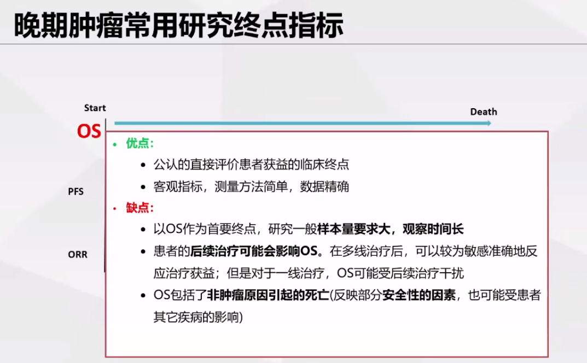
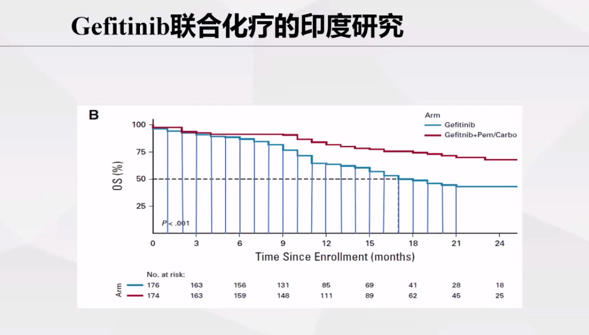
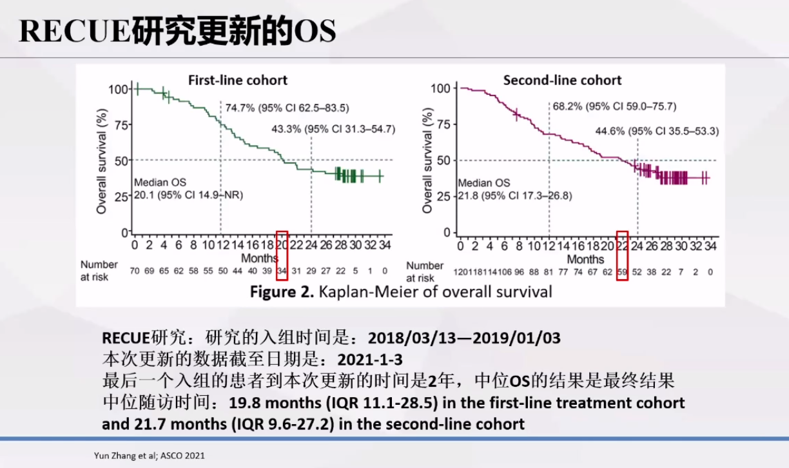

摘录自**复旦大学附属中山医院肿瘤免疫讲坛（第十二期）**，讲者为**复旦大学附属中山医院 梁斐教授**

## 晚期肿瘤研究常用终点指标：OS、PFS、ORR

## 中位PFS/OS

### 实际中的中位PFS/OS与理论定义的中位PFS/OS不同

研究报告中的中位PFS/OS数据，并不真正代表有一半的患者在这个时间点没有进展或死亡

以下研究的生存曲线下降趋势有些怪异，做出垂直线后发现，该研究中患者的死亡时间都在每个月的第一天

该研究的研究者回复如下

### 中位PFS/OS的不稳定性

- 中位PFS/OS是否稳健，可参考如下三个指标
  - **可信区间**越窄，中位PFS越稳健
  - **中位随访时间**比中位PFS越长，中位PFS越稳健
  - 中位PFS时间点对应的**Number at risk**越多，中位PFS越稳健
- **当中位值附近，OS/PFS曲线存在较长平台期的情况下，对于中位PFS/OS的解读需要特别谨慎**

## TTR

更正：纳入到“TTR”的分析中

**PFS的KM曲线无法评价起效时间，只能评价进展时间**

## 小结

