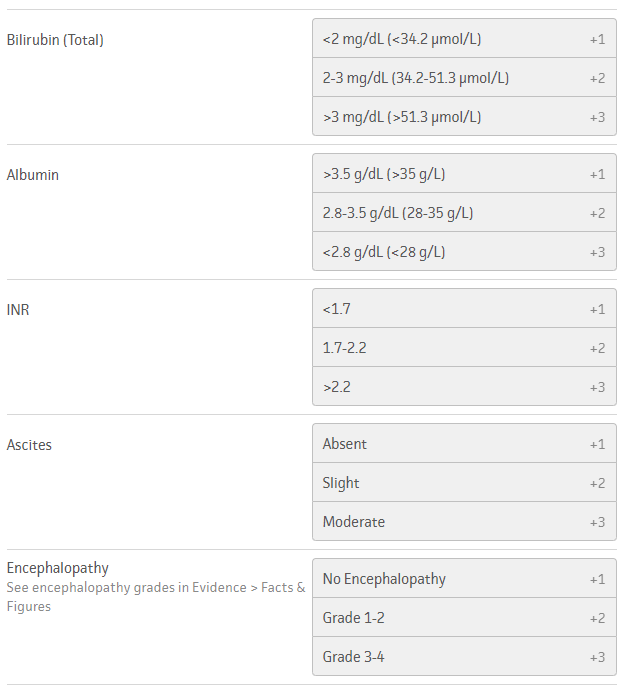
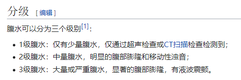
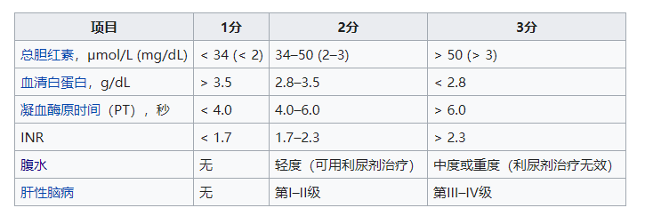
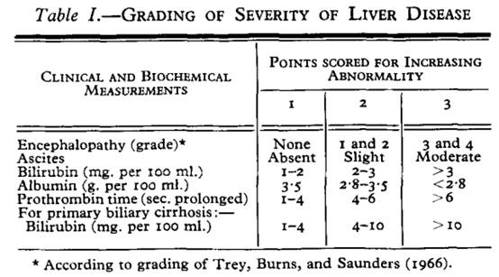
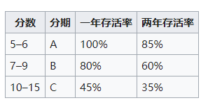
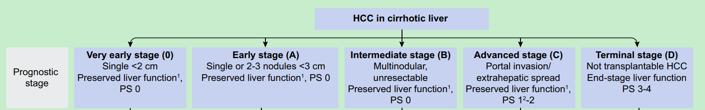
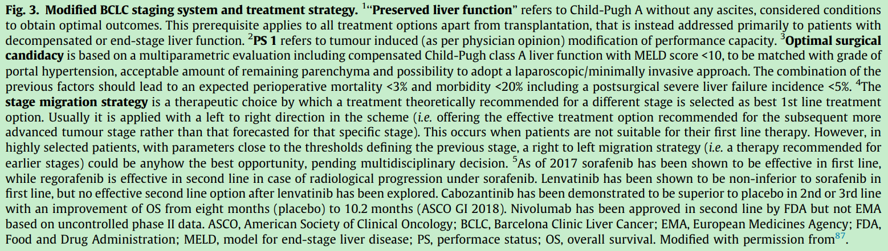
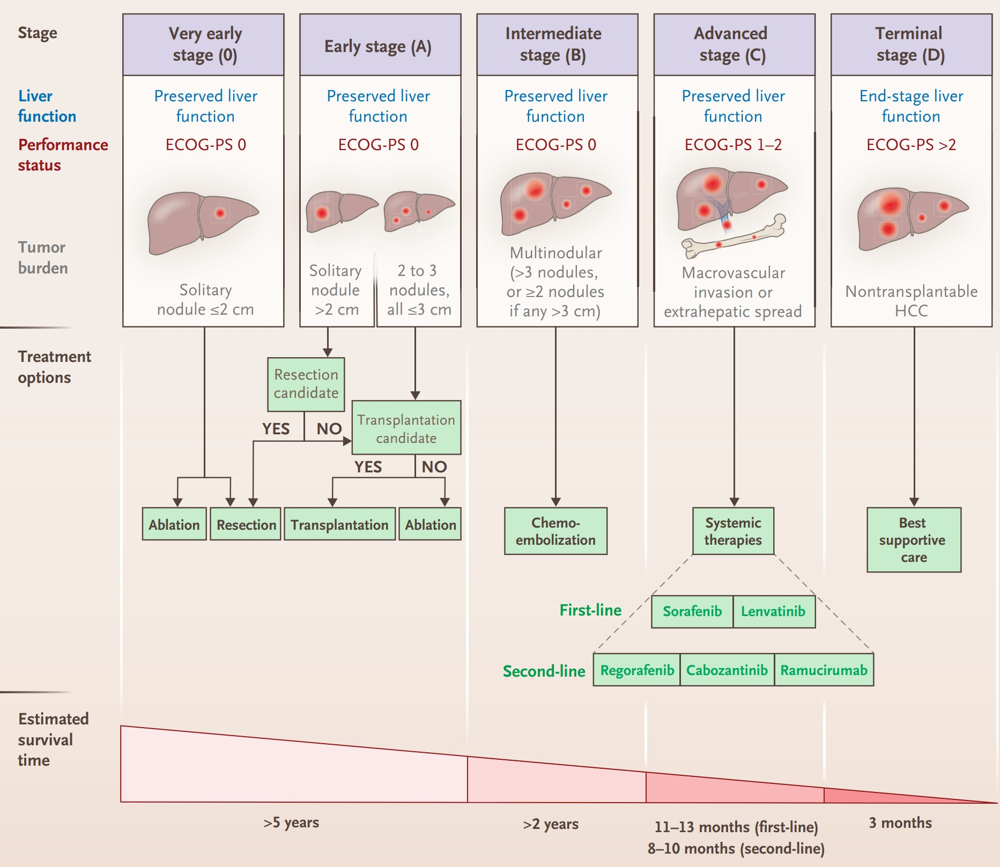
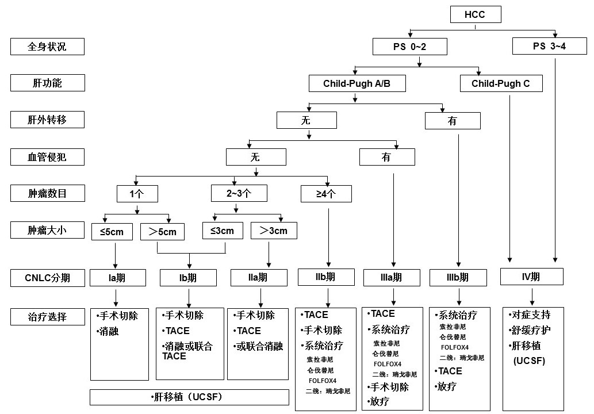

## Child-Pugh

### 评分

参考自[mdcalc](https://www.mdcalc.com/child-pugh-score-cirrhosis-mortality#pearls-pitfalls)

#### 关于腹水

参考自[wikipedia](https://zh.wikipedia.org/wiki/%E8%85%B9%E6%B0%B4)

腹水量参考：

- **移动性浊音**阳性，可提示腹腔存在游离液体，且液体量超过1000ml
  - 参考自[1](https://www.med66.com/zhuliyishijineng/shitizhenti/my1808312210.shtml)、[2](https://baike.baidu.com/item/%E7%A7%BB%E5%8A%A8%E6%80%A7%E6%B5%8A%E9%9F%B3)
- **液波震颤**检查腹水，需有3000至4000ml以上液量才能查出
  - 参考自[百度百科](https://baike.baidu.com/item/%E6%B6%B2%E6%B3%A2%E9%9C%87%E9%A2%A4)

#### 若用PT代替INR

参考自[wikipedia](https://zh.wikipedia.org/wiki/Child-Pugh%E5%88%86%E6%9C%9F%E7%B3%BB%E7%B5%B1)

该表中PT的参考值与发表Child-Pugh评分的原文[^1]一致，以下为原文：

### 分级

参考自[wikipedia](https://zh.wikipedia.org/wiki/%E8%85%B9%E6%B0%B4)

## BCLC

参考文献[^2], [^3]

Preserved liver function，Child-Pugh A级（或B级7分）

## CNLC

参考自**原发性肝癌诊疗规范（2019年版）**

CNLC Ia期：体力活动状态（performance status，PS）评分 0～2分，肝功能Child-Pugh A/B级，单个肿瘤、直径≤5cm，无血管侵犯和肝外转移；

CNLC Ib期：PS 0～2分，肝功能Child-Pugh A/B级，单个肿瘤、直径＞5cm，或2～3个肿瘤、最大直径≤3cm，无血管侵犯和肝外转移；CNLC IIa期：PS 0～2分，肝功能Child-Pugh A/B级，2～3个肿瘤、最大直径＞3cm，无血管侵犯和肝外转移；

CNLC IIb期：PS 0～2分，肝功能Child-Pugh A/B级，肿瘤数目≥4个、肿瘤直径不论，无血管侵犯和肝外转移；

CNLC IIIa期：PS 0～2分，肝功能Child-Pugh A/B级，肿瘤情况不论、有血管侵犯而无肝外转移；

CNLC IIIb期：PS 0～2分，肝功能Child-Pugh A/B级，肿瘤情况不论、血管侵犯不论、有肝外转移；

CNLC IV期：PS 3～4，或肝功能Child-Pugh C级，肿瘤情况不论、血管侵犯不论、肝外转移不论。

---

[^1]: Pugh RN, Murray-Lyon IM, Dawson JL, Pietroni MC, Williams R. Transection of the oesophagus for bleeding oesophageal varices. Br J Surg. 1973 Aug;60(8):646–9.

[^2]: Galle PR, Forner A, Llovet JM, Mazzaferro V, Piscaglia F, Raoul J-L, et al. EASL Clinical Practice Guidelines: Management of hepatocellular carcinoma. J Hepatol. 2018 Jul 1;69(1):182–236.

[^3]: Villanueva A. Hepatocellular Carcinoma. N Engl J Med. 2019 11;380(15):1450–62. 