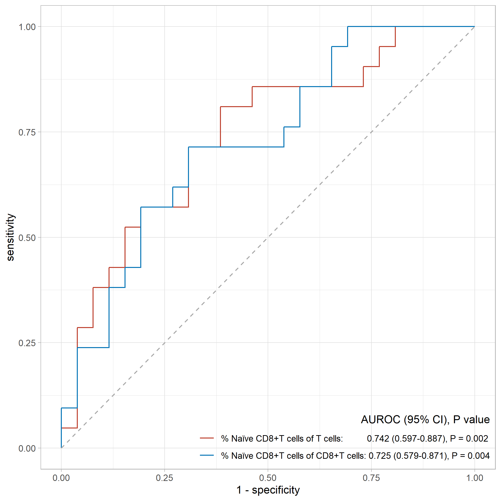

```{r setup, include=FALSE}
knitr::opts_chunk$set(eval = FALSE)
```


## 将Excel导入后的数字转换为日期

``` r
openxlsx::convertToDate(42705)

[1]"2016-12-01"
```


## 生存分析

```{r, eval=FALSE}
# 生存数据示例
library(survival)
library(survminer)

OS <- Surv(time = df$OS, event = df$OS_status)
RFS <- Surv(time = df$RFS, event = df$RFS_status)
```

### 画生存曲线

```{r, eval=FALSE}
library(survival)

ggsurvplot(fit = survfit(OS ~ 1, data = df), 
           palette = "jco", # or palette = c("#E7B800", "#2E9FDF"),
           
           # Allowed values are one of c("top", "bottom", "left", "right", "none"). 
           # Legend position can be also specified using a numeric vector c(x, y). 
           # In this case it is possible to position the legend inside the plotting area. 
           # x and y are the coordinates of the legend box. Their values should be between 0 and 1.
           legend = "none", 
           legend.title = "group",
           legend.labs = c("DCP responder", "DCP nonresponder"),
           
           pval = T, # 也可以直接指定要显示的p value
           # numeric vector, of length 2, specifying the x and y coordinates of the p-value. 
           # Default values are NULL.
           pval.coord = c(50, 1), 
           
           conf.int = F,
           
           surv.median.line = "hv",
           
           # title = "Progress-Free Survival",
           ylab = "Overall Survival",
           xlab = "Months",
           
           # axes.offset = F, # Default is TRUE. If FALSE, set the plot axes to start at the origin.
           ylim = c(0,1),
           break.y.by = 0.2,
           # surv.scale = "percent", 
           xlim = c(0, 60),
           break.x.by = 12,
           # xscale = "d_m", # will transform labels from days to months
           
           risk.table = T,
           risk.table.title = "Number at Risk",
           risk.table.y.text = F,
           risk.table.y.text.col = T,
           risk.table.height = 0.15,
           ggtheme = theme_survminer(base_size = 6),
           tables.theme = theme_cleantable(base_size = 6))
```


### 批量单因素logrank函数

```{r, eval=FALSE}
uni_logrank <- function(gvar, surv, df) {
  temp <- survdiff(as.formula(paste0(surv, " ~ ", gvar)), 
                   data = df)
  p.value <- round(broom::glance(temp)$p.value, 3)
  return(p.value)
}

# OS
uni_logrank_batch_OS <- sapply(vars, uni_logrank, "OS", df)
uni_logrank_batch_OS[uni_logrank_batch_OS < 0.05]

# RFS
uni_logrank_batch_RFS <- sapply(vars, uni_logrank, "RFS", df)
uni_logrank_batch_RFS[uni_logrank_batch_RFS < 0.05]
```


## ROC曲线

```{r, eval=FALSE}
library(dplyr)
library(ggplot2)
library(ggsci)

# library(showtext)
# 
# font_add("yahei","msyh.ttc")
# showtext_auto(enable = TRUE)

# ggroc()的用法在为知笔记
ggroc(list(totalT = roc_naiveCD8T_totalT,
           CD8T = roc_naiveCD8T_CD8T),
      legacy.axes = TRUE) + 
  geom_segment(aes(x = 0, xend = 1, y = 0, yend = 1), # 添加auc = 0.5的线
               color = "darkgrey", linetype = "dashed") +
  scale_color_nejm(labels = c("% Naïve CD8+T cells of T cells:          0.742 (0.597-0.887), P = 0.002", 
                              "% Naïve CD8+T cells of CD8+T cells: 0.725 (0.579-0.871), P = 0.004")) +
  theme_light() + 
  theme(legend.position = c(1,0), 
        legend.justification = c(1,0),
        legend.title.align = 1,
        legend.background = element_blank(),
        legend.key = element_blank()) + 
  guides(color = guide_legend(title = "AUROC (95% CI), P value"))
  
ggsave("figure/roc.pdf", 
       width = 7, height = 7, units = "in")
```



## 百分比条形图

```{r}
# 导入数据 dat_waterfall_chart
load("data/dat_waterfall_chart.RData")

head(dat_waterfall_chart)
```

"≥"在图中的写法参考自[stackoverflow](https://stackoverflow.com/questions/13192984/displaying-a-greater-than-or-equal-sign)

```{r, eval=FALSE}
suppressMessages(library(dplyr))
library(ggplot2)
library(ggsci)

dat_waterfall_chart <- dat_waterfall_chart %>% 
  mutate(group_response = ifelse(tumor.response %in% c("CR", "PR"), 
                                 "Responsder", "Nonresponder"))

prop.table(table(dat_waterfall_chart$group_response, dat_waterfall_chart$group_naiveCD8T_totalT,
                 dnn = list("response", "totalT")),
           margin = 2)

dat_bar <- tibble(response = rep(c("Nonresponder", "Responder"), times = 2),
                                  totalT = rep(c("high", "low"), times = 1, each = 2 ),
                                  pct = c(80, 20, 37, 63))

ggplot(dat_bar, aes(x = totalT, y = pct, fill = response)) +
  geom_bar(stat = "identity", 
           width = 0.8) + # 设置条形的宽度和间距 默认值为0.9
  scale_y_continuous(expand = c(0, 0), # y轴底部从原点开始 不留空白
                     name = "Proportion of Patients (%)",
                     limits = c(0, 108)) + # 为了添加的"*"能够显示完整 扩展y轴范围
  scale_x_discrete(labels = c(expression(phantom(x) >= "6.24%"), # "≥"在图中的写法
                              "< 6.24%"),
                   name = "Naïve CD8+ T cells / T cells ratio") + 
  theme_classic() + 
  theme(legend.position = "top", 
        legend.background = element_blank(), # 移除图例整体的边框
        legend.key = element_blank(), # 移除每个图例项目周围的边框
        legend.title = element_blank(),
        axis.title.x = element_text(size = 10)) + # 缩小字体 否则导出时字体会溢出
  scale_fill_nejm() + 
  annotate("text", x = 1, y = c(60, 10),
           label = c("80.0%", "20.0%"),
           color = "white") + 
  annotate("text", x = 2, y = c(37/2 + 63, 63/2),
           label = c("37.0%", "63.0%"),
           color = "white") + 
  annotate("segment", x = 1, xend = 2, y= 102.5, yend = 102.5) + 
  annotate("text", x = (1+2)/2, y = 105,
           label = "**", size = 5)

```

```{r, eval=FALSE}
ggsave("figure/Figure_bar_totalT.png", 
       width = 3, height = 4, units = "in")
```


## 瀑布图

```{r, eval=FALSE}
# 导入数据 dat_waterfall_chart
load("data/dat_waterfall_chart.RData")

head(dat_waterfall_chart)
```

"≥"在图中的写法参考自[stackoverflow](https://stackoverflow.com/questions/13192984/displaying-a-greater-than-or-equal-sign)

```{r, eval=FALSE}
suppressMessages(library(dplyr))
library(ggplot2)
library(ggsci)

ggplot(data = dat_waterfall_chart,
       aes(x = No., y = change, fill = group_naiveCD8T_totalT)) + 
  geom_bar(stat = "identity", position = "identity", 
           width = 0.8) + # 设置条形的宽度和间距 默认值为0.9
  geom_hline(yintercept = 0) + 
  geom_hline(yintercept = c(-30, 20, -100), 
             linetype = 2, size = 1.05) + 
  # geom_text(aes(label = T_response, color = T_response), 
  #           # hjust = -0.2,
  #           angle = 90) + 
  annotate("text", x = -Inf, y = -24, hjust = -0.1,
           label = "# new lesions", 
           color = "#BC3C29FF", size = 4.5) + 
  # 分开添加tumor response的注解
  annotate("text", x = 1:14, y = -15, angle = 90, hjust = 0,
           label = dat_waterfall_chart %>% 
             filter(change >= 0) %>% 
             pull(T_response),
           color = dat_waterfall_chart %>% 
             filter(change >= 0) %>% 
             pull(colors)) + 
  annotate("text", x = 15:47, y = 2, angle = 90, hjust = 0,
           label = dat_waterfall_chart %>% 
             filter(change < 0) %>% 
             pull(T_response),
           color = dat_waterfall_chart %>% 
             filter(change < 0) %>% 
             pull(colors)) + 
  scale_y_continuous(limits = c(-100, 30), 
                     breaks = seq(-100, 20, 20),
                     name = "Change From Baseline (%)") +
  theme_classic(base_size = 12) + # 默认字体大小为12
  # guides(color = "none") + # 取消映射给color的图例
  labs(fill = "Naïve CD8+ T cells / T cells ratio") + # 设置映射给fill的图例标题
  theme(legend.position = c(0.16, 0.18),
        legend.background = element_blank(), # 移除图例整体的边框
        legend.key = element_blank(), # 移除每个图例项目周围的边框
        axis.text.x = element_blank(), # 移除x轴标签
        axis.title.x = element_blank(), # 移除x轴标题
        axis.line.x = element_blank(), # 移除x轴横线
        axis.ticks.x = element_blank()) + # 移除x轴刻度线
  # scale_color_aaas() + 
  scale_fill_nejm(labels = c(expression(phantom(x) >= "6.24%"), # "≥"在图中的写法
                             "< 6.24%"))

```


```{r, eval=FALSE}
# 保存图片
ggsave("figure/Figure_Change_totalT.pdf", 
       width = 10.5, height = 4, units = "in")

# 本例中用到的颜色
scales::show_col(pal_nejm()(9))
scales::show_col(pal_npg()(9))
```

